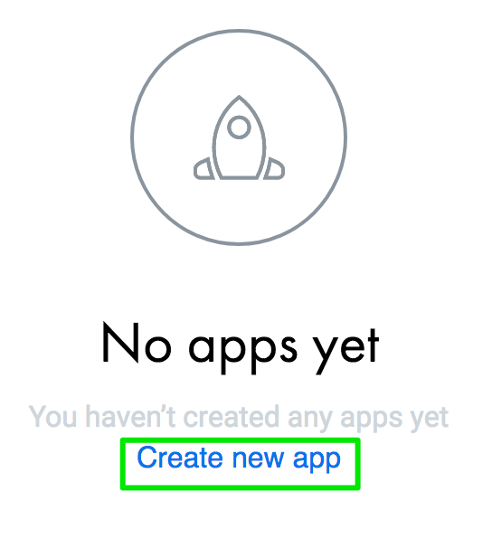

# Get Started Guide

## Create your account

The first thing to do to start using Revolut's Open Banking API is to create an account:

1. Our sign up process is extremely simple, access our portal: https://developers.revolut.com/signup.
2. Enter a valid email address and click on `Sign up`. An automatic 6-digit verification code will be sent to your email address.
3. Open your email account and copy/paste the `verification code` to confirm your email.
4. Enter your `name` and click **`continue`** (you can add a `logo` and the `link` to your website if you want to).
5. Create a `password`: keep in mind the policy when selecting your password:

   - 8 or more characters
   - Numbers
   - Latin letters
   - Special characters

You've completed your developer profile!
You are now logged into the portal with your new account! Welcome to __Revolut's Open Banking API__!

## Let's create your first app

You can create an app by accessing [My Apps](https://developers.revolut.com/apps). You don't have any apps yet, let's create one.

Click on `Create a new app`

Enter your `App name`, your `OAuth redirect URI` (you can add more than one) and set-up the rights of your app (will it be read-only? If yes do not touch anything. If you need write access please click on the button to enable it). Click on `Continue`.

**You’ve created your first app!**

*Please note that you can use your app with a sandbox account only. Please keep your app credentials private to avoid third-parties hijacking your app.*

You now need to set your Open Banking `organisation id` in the [Profile section](https://developers.revolut.com/profile). This is required to link your applications with your developer account during `Dynamic Application Registration` process of Open Banking API.

## Get access to the sandbox environment
Once you created your account and set your organization id, you can ask for a test user account for sandbox environment by mailing to openbanking-support@revolut.com

## Make your first API call

**`MISSING INFORMATION as I didn't request the account in test`**

Congratulations! You have just made your first Revolut Open Banking API call!

## What's next?

### Explore our API catalog

You can find all our APIs in our [API catalogue](https://revolut-engineering.github.io/oba/#account-and-transaction-api).
